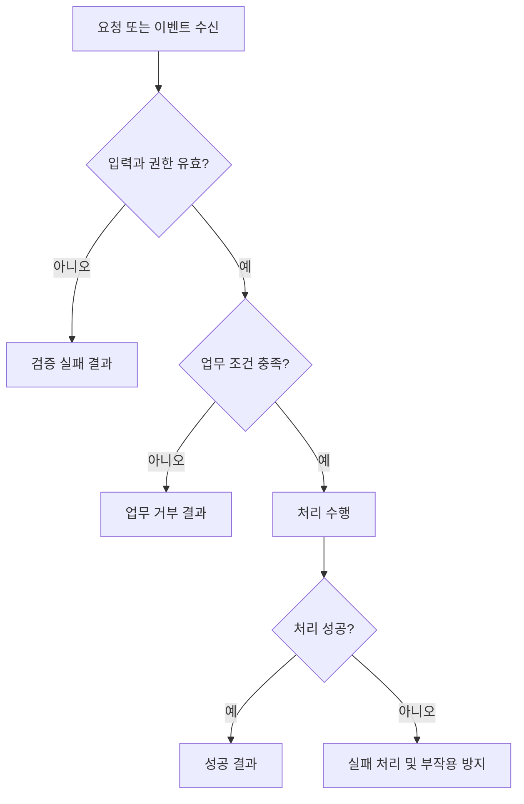

# FLOW: <기능명>

> 기획 단계에서 실제 업무의 정상·실패·분기를 Mermaid로 작성한다.
> 아래 노드와 규칙은 예시다. PRD 또는 WORK의 BR/AC, API-SPEC의 operationId와 맞춰 교체한다.
> 계약: [API-SPEC.md](API-SPEC.md). API가 없는 배치/이벤트도 실제 처리 흐름을 그린다.

## 1. 처리 흐름

## 2. 규칙과 검증 연결

| 노드/분기 | BR | AC | operationId 또는 이벤트/배치 | 결과/오류 |
|---|---|---|---|---|
| Validate → Reject | 실제 BR ID | 실제 AC ID | 실제 식별자 | 실제 오류 |
| Result → Success | 실제 BR ID | 실제 AC ID | 실제 식별자 | 실제 성공 결과 |
| Result → Failure | 실제 BR ID | 실제 AC ID | 실제 식별자 | 실제 오류 및 복구 |

## 3. 추가 다이어그램과 가정
- 외부 호출/비동기 메시지 순서가 중요하면 Mermaid sequenceDiagram을 추가한다.
- 상태 전이가 중요하면 Mermaid stateDiagram-v2를 추가한다.
- 미확정 분기와 외부 의존성, 재시도·멱등성·트랜잭션 경계를 명시한다.
- Mermaid 실제 렌더링 확인 여부와 PRD/API/AC 정합성 검토 결과를 기록한다.
